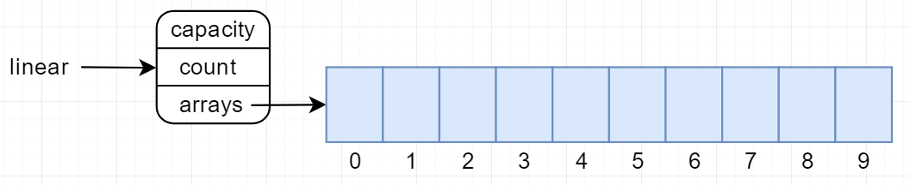

# 数组实现的线性表

`head`:指向控制头的指针 `capacity`:线性表容量 `count`:元素个数 `arrays`：数组指针

基本功能:

*   增加：追加元素
*   插入：插入到指定位置
*   删除：删除指定位置元素
*   查看：得到指定下标元素
*   修改：修改指定下标元素
*   迭代: 遍历列表并由用户决定如何操作
*   排序：根据用户提供的比较函数进行升序或者降序
*   得到第一个和目标元素匹配的元素下标
*   判空、判满、重置

与链表相比较：
1、链表插入、删除操作时间复杂度o(1)，数组为o(n)
2、arrayList的物理存储是内存中连续的片段，而链表则一般不连续，是通过指针串起来的
3、arrayList的空间是固定的，分大了浪费，分小了溢出。而链表是根据所需动态分配。
