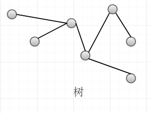
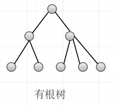
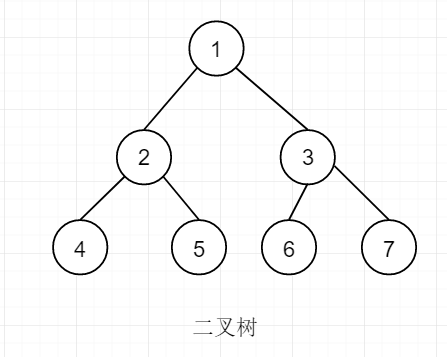
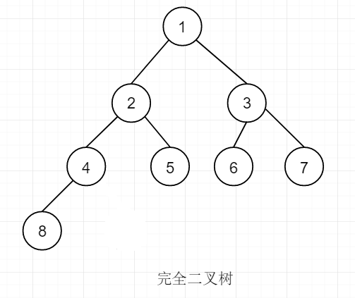
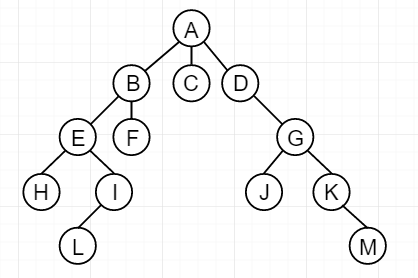

## 树

树是一种非线性逻辑结构，其是一个**连通**的、**无环**的**无向图**。

## 有根树

有根树中有一个顶点和不同于其他顶底，该顶点就是该树的**根**，我们一般所说的树就是有根树。

基本概念：

*   根节点:没有双亲节点的节点
*   节点的度:每个节点的子节点数目
*   叶子节点:没有子节点的节点
*   树的深度:从根节点出发，到达最远叶子节点的层数

若n0为度为0的节点个数，ni为度为i的节点个数。则有根树的节点总数为：
`n = n0 + n1 + n2 + …… + ni`；或者根据子节点来计算是`n = 0·n0 + 1·n1 + 2·n2 + …… + i·ni + 1`。

## 二叉树

首先，二叉树是有根树。其任意节点的子节点数**不大于2个**，并且子节点有方向，分别为**左孩子**和**右孩子**。若对树的节点从1进行编号，则第 i 个节点的左孩子的编号为 2·i，右孩子节点是 2·i+1。

根据有根树总节点数n的计算可得出两种计算方式：

1.  `n = n0 + n1 + n2`
2.  `n = n1 + 2·n2 + 1`

2式-1式可得到二叉树性质，**`n0 = n2 + 1`**。

## 满二叉树

深度为 h 的二叉树，若其总节点数为2^h-1个，则这棵二叉树为满二叉树。满二叉树的节点数量为奇数个。

## 完全二叉树

若设二叉树的深度为h，除第 h 层外，其它各层 (1～h-1) 的节点数都达到最大个数，第 h 层所有的节点都**连续集中在最左边**，即度为1的节点只能为0或1，这就是完全二叉树。

根据有根树总节点数n的计算及二叉树性质：

1.  `n = n0 + n1 + n2`
2.  `n0 = n2 + 1`

联立消除n2得到：`n = 2·n0 + n1 - 1`。对于完全二叉树，度为1的节点数只能为0(总节点数为奇数)或1(总节点数为偶数)，即n1=0或1。由此可得：**`n0 = (n+1)/2或者n0 = n/2。`**

## 树的遍历

*   广度优先遍历(借用队列)

    eleIn(rootNode);                    //根节点入队
    while (!isEmpty(queue)) {
        printf("……", enlOut(queue));    //出队
        eleIn(rootNode.left);            //子节点入队
        eleIn(rootNode.right);
    }
    `</pre>
    > 遍历结果：A B C D E F G H I J K L M

*   深度优先遍历(借用堆栈)
    <pre>`push(rootNode);                    //根节点入栈
    while (!isEmpty(stack)) {
        printf("……", pop(stack));    //出栈
        push(rootNode.right);        //子节点入栈
        push(rootNode.left);
    }

> 遍历结果：A B E H I L F C D G L K M

## 二叉树的遍历

只有有子节点的节点都是根。

*   先根序遍历
(根)(左子树节点集合)(右子树节点集合)

    > 遍历结果:A B D F G J C E H I K

*   中根序遍历
(左子树节点集合子)(根)(右子树节点集合)

    > 遍历结果:F D J G B A C H E I K

*   后根序遍历
(左子树节点集合)(右子树节点集合)(根)

    > 遍历结果:F J G D B H K I E C A