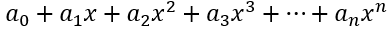
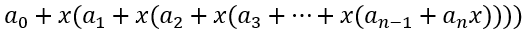

# 霍纳法则

对于如上形式的多项式，一般求其值时会一项一项求值最后相加,这样的计算使用了n个加法以及n·(n-1)/2个乘法。并且当项数增多时，会造成计算的复杂。因此在一位叫做Horner的教师的研究下发现了一种简便的解法，就是霍纳法则。它将多项式加以变化，形式如下。

可以看出整个多项式甚至可以写成`a+bx`的嵌套形式。对于这种循环出现的形式，计算机是很容易处理的，并且只使用了n个加法和n个乘法。
