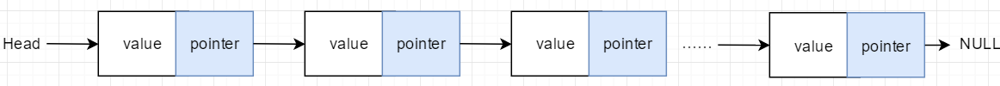
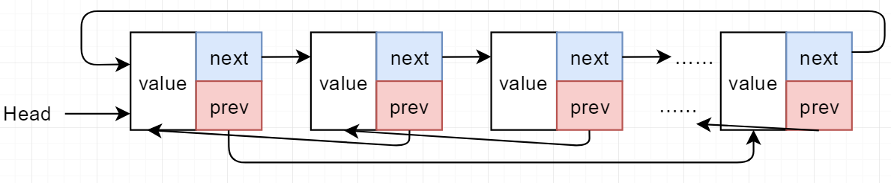

# 单向链表(one way linked list)

`head`:头节点指针
`value`:数据域
`pointer`:指向其后继节点的指针

遍历条件:`while (ptr != NULL)`

基本功能:

*   增加：追加元素
*   插入：插入到指定位置(包括头节点)
*   删除：删除指定位置，包括头节点
*   查看：得到指定下标元素
*   修改：修改指定下标元素
*   迭代: 遍历列表并由用户决定如何操作
*   排序：根据用户提供的比较函数进行升序或者降序
*   得到第一个和目标元素匹配的元素下标

# 双向循环链表(Double Linked List)

`head`:头节点指针
`head->prev`:尾节点指针
`value`:数据域
`next`:指向后继节点的指针
`prev`:指向前驱节点的指针

遍历条件:`while (ptr != head)`(对于不带头节点的双向循环链表, 第一个节点的地址就是head，因此ptr的初值是head->next，需要将第一个节点和其他节点分开处理)

相对于单向链表的优势:

1.  插入、删除逻辑方便
2.  双向遍历
