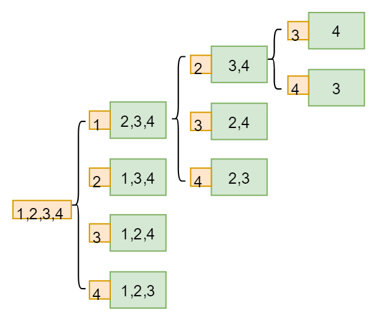
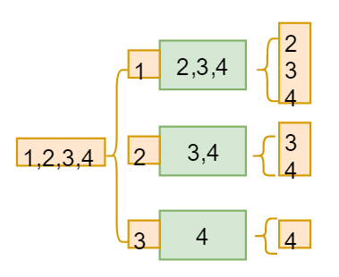

# 全排列

例如，求取`(1,2,3,4)`的全排列，一共`4! = 24`种。对于第一个位置，初始存在`4`中可能，分别为`1,2,3,4`，接着剩下的三个位置就好比再求取其他三个数的全排列，这就具有递归性质。

假如第一个位置为`1`，则剩余三数为`2,3,4`。看作是三个数的全排列，第二个位置假如为`2`，接着是两个数的全排列，第三个位置为`3`，接着是一个数的全排列，第四个位置即为`4`。而这次全排列结束后返回上一级，两个数的全排列只考虑了`3`一种情况，还可以为`4`，而`3`和`4`就是一次`swap()`过程，接着一个数的全排列，为`3`。继续返回到三个数的全排列，同理进行交换。

> 注意：每次子数组排列后都要将交换的数据恢复,保证当前全排列的第一个位置不变。

# 组合

假如求取组合为`C(n,m)`，可以看出，求取组合的方式是每次从原始集合内`n`中取一个元素，然后对剩余集合`(n-1)`进行`m-1`次组合。