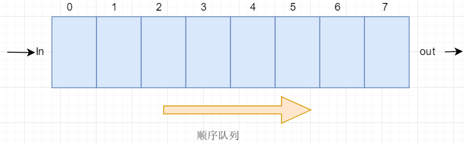
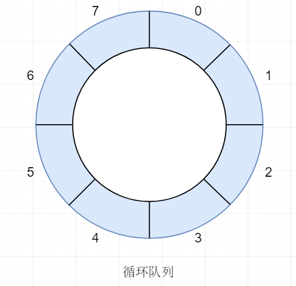

# 顺序队列



队列是一种特殊的线性表，其规则是先进先出，可以采用顺序方式实现。但使用数组实现的顺序队列会产生“假满”，入队时，in后移，出队时out后移，
当到达最后一个位置时，in和out已经不能增长，但是out前面的位置都是空余的，但已经不能存储元素了。因此**使用数组实现时使用循环结构，使用链表实现可以构造顺序队列(append和delete组合实现)。**

# 循环队列



基本功能：
*	判空、判满
*	入队
*	出队
*	读队尾

1. 实现循环队列时，需要判满、判空。当`in = out`时，可能为空，也可能为满，就造成无法识别的情况。
这种情况可采用两种方式解决：

	(1) 对于n个存储位置，只使用n-1个位置。此时： 	
	QueueEmpty条件：`in == out`
	QueueFull条件：`out == (in+1) % capacity`
	
	(2) 使用全部存储位置，在结构体中增加一个控制变量，用它来判断。
	例如：增加一个boolean类型的变量`isLastIn`。
	在向最后一个位置添加元素时时，令`isLastIn = TRUE`。
	在In函数中增加： 
```
if ((in - out + capacity) % capacity == (capacity - 1)) {
	isLastIn = TRUE;
}
```
	只要进行出队操作，就将`isLastIn = FALSE`。
	在Out函数增加：
```
if (isLastIn == TRUE) {
	isLastIn = FALSE;
} 
```
		
	此时：
	QueueEmpty条件：`(in == out) && (isLastIn == FALSE)`
	QueueFull条件：`isLastIn == TRUE` 
  
  2. 队列元素个数的确定：
	in,out 的取值范围是 `[0, capacity)`
	
	假设 capacity = 8;
	当out = 0, in = 7时，队列存在7个元素;
	当out = 0, in = 8时，队列存在8个元素;
	当out = 5, in = 0是，队列存在3个元素。 
	因此可得出 `elementCount = (in - out + capacity) % capacity`
