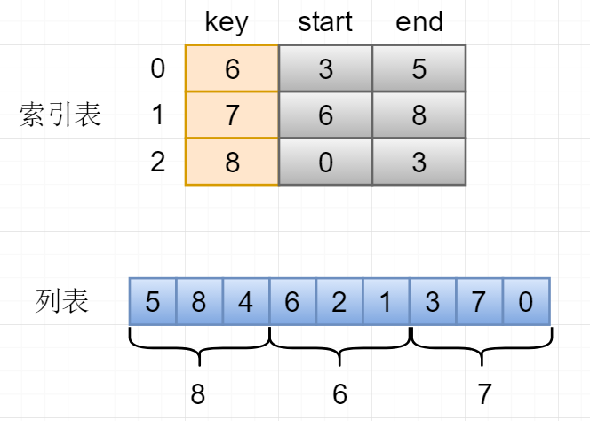

# 顺序查找

顺序查找**对目标列表无顺序要求**，但时间复杂度为`O(n)`。
但实际情况中顺序查找都采用**启发式搜索方式**，若一次查找后找到了元素，就将元素移动到列表的前端，因此最常使用的元素查找就很快，这样可以大大提高搜索效率。搜狗输入法等都采用这种方式，把常用的字或者词放到列表前端。

特点:效率不高，但对列表无特殊要求。**对插入、删除无影响**。

# 折半查找

折半查找要求列表元素**必须有次序关系**，并且可比较，如升序和降序。这种算法借用分治的思想，将一整个列表L不断的二分为L/2，L/4，直到在某一次L的一半中找到目标元素或者未找到为止。算法借用`head`、`tail`、`middle`三个指针，分别指示列表的头元素、尾元素、中间元素。每次循环或者递归都要根据`value`和`list[middle]`的比较情况修改`head`或`tail`与`middle`。该算法查找类似于遍历一颗二叉树，所以时间复杂度为`O(log2(n))`。

特点:数据越多效率越高，但必须要求列表有序。**若有频繁的插入、删除，就会产生多次排序**。

# 索引查找

索引查找借鉴了顺序查找和者按查找的优点。其基本思想如下:

*   将列表`List`分割为一些小块，每块包含列表中的若干连续元素，这些元素之间可以是无序的，但是分割的这些小块**必须有序**。

*   这些小块包含3个基本属性：`key:小块中的最大元素`、`start:小块元素在列表中的起始下标`、`end:小块元素在列表中的终止下标`。

*   建立完小块索引表`IndexList`后，查找元素时先在索引表进行二分查找，根据索引表的`key`查找到该元素所在的小块。然后根据该小块中的索引信息在`List`中查找元素，并返回在列表`List`中的下标。

特点:具有二分查找的优点，但是并不要求实际列表有序。但算法较上两种复杂。